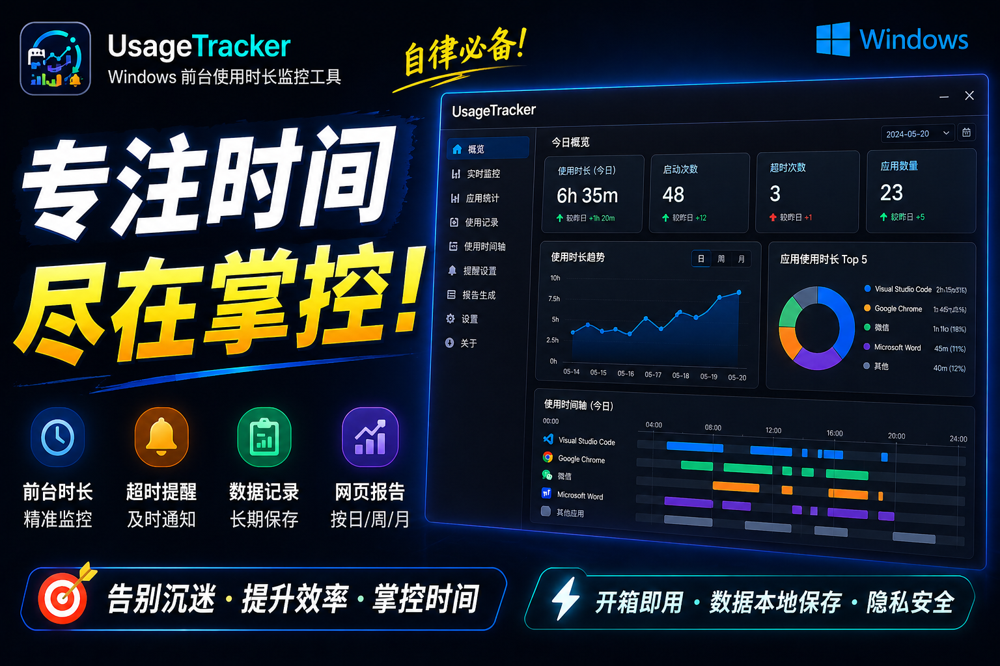

<p align="center">
  
</p>

<h1 align="center"> UsageTracker</h1>

<p align="right">
  <a href="README.zh-CN.md">中文</a> | English
</p>

<p align="center">
  <b>Windows Desktop Application Usage Time Tracker</b><br>
  Lightweight system tray app that silently records your screen time
</p>

<p align="center">
  
  
  
  
</p>

---

### 🎯 How to Use

#### 📥 Download & Install (Recommended)

**Just want to use it? Download the installer:**

🔗 **[👉 Go to Releases page](../../releases)**

1. Download the latest `UsageTracker_Setup_x.x.x.exe`
2. Run the installer and follow the wizard (choose your language at startup)
3. After installation, the app starts automatically and minimizes to the system tray

> 💡 No action needed day-to-day. The app runs silently in the background. Right-click the tray icon to view daily reports, open settings, etc.

#### 📊 View Reports

- **Daily Report**: Right-click tray icon → "Yesterday's Report"
- **Weekly / Monthly Report**: Right-click tray icon → "Last Week Report" or "Last Month Report"
- Reports open as beautiful HTML pages with interactive charts, app rankings, game time comparisons, etc.
- Supports 3 themes: 🌸 Fairy Tale / 💼 Business / 📝 Minimal — switch in Settings

#### ⚙️ Settings

Right-click tray icon → "Settings" to open the **Web UI** in your browser. Settings include 7 tabs:

| Feature | Description |
|:---|:---|
| **General** | Language switch, auto-start on boot, auto-show yesterday's report on startup |
| **Categories** | View/edit custom categories; assign apps via running process list |
| **Browsers** | View detected browsers (7 built-in), add custom browsers |
| **Games** | View detected running games, manually add or remove game directories |
| **Ignore List** | Exclude apps from tracking; add from running processes, remove, or clear all |
| **Database** | View database size & records, preview recent data, cleanup old data, backup |
| **Feedback & Logs** | Adjust log level, view runtime logs, submit feedback (opens feedback folder) |

> **v0.3.0 Note**: The settings interface has been fully migrated from tkinter GUI to a **Web UI** (accessible at `http://127.0.0.1:19234`). The system tray icon remains for quick access to reports and shutdown.

#### 🚫 Ignore Apps from Reports

In the daily report, each app row has a **✕** button on the right. Click it to ignore that app — it won't appear in future reports.

---

### 🌟 Features

- **🪟 Automatic Tracking**: Runs on startup, records which apps you use and for how long — zero manual effort
- **🌐 Browser Classification**: Chrome, Edge, Firefox, etc. tracked separately for accurate internet time
- **🎮 Game Detection**: Auto-detects Steam games, HoYoverse titles, and more — independent game time tracking
- **📊 Visual Reports**: Daily / Weekly / Monthly reports with interactive charts and 3 switchable themes
- **🔔 Timeout Alerts**: System notifications when you've been using browsers or games for too long
- **🛡️ Fully Local**: No network, no uploads, no ads — all data stays on your computer
- **🌐 Bilingual**: Full Chinese and English support — choose at install time or switch in settings

---

### 💬 Community

Have questions or want to share your experience? Join our QQ group: **747117152**

---

### ⬇️ Developer Documentation

> ⚠️ **If you just want to use this app, everything above is sufficient. The content below is for developers only.**

---

### 🛠️ Development

Built with **Python 3.11+**, minimal dependencies (only 3):

```bash
# 1. Clone the repo
git clone https://github.com/GiftedScout/UsageTracker.git
cd UsageTracker

# 2. Create venv and install dependencies
python -m venv .venv
.venv\Scripts\activate
pip install -r requirements.txt

# 3. Run
python -m src.main
```

> After launch, the app minimizes to the system tray (bottom-right). Right-click the tray icon to open reports or settings.

---

### 📦 Build Installer

Two-stage build with **PyInstaller + Inno Setup**:

```bash
# Install build dependencies
pip install pyinstaller

# Stage 1: PyInstaller → single-directory exe
pyinstaller UsageTracker.spec

# Stage 2: Inno Setup → installer (requires Inno Setup)
iscc installer.iss
```

---

### 📁 Project Structure

| File / Folder | Description |
|:---|:---|
| `src/` | Core modules (tracking engine, data store, report generator, notifications, i18n, bridge HTTP server) |
| `ui/` | Web UI settings (HTML/CSS/JS) |
| `locales/` | Translation files (zh-CN.json, en.json) |
| `assets/` | Static resources (app icon, Chart.js, report theme CSS) |
| `docs/` | Design documents |
| `installer.iss` | Inno Setup installer script |
| `requirements.txt` | Python dependencies |
| `LICENSE` | GPL-3.0 license |

---

### 🛠️ Tech Stack

| Layer | Technology |
|:---|:---|
| Language | Python 3.11+ |
| UI | Web UI (HTML/CSS/JS) + pystray (system tray) + Pillow |
| Database | SQLite (stdlib) |
| Charts | Chart.js (embedded in reports) |
| i18n | Custom JSON-based lightweight module |
| Build | PyInstaller → Inno Setup |
| Dependencies | Only psutil + pystray + Pillow — ultra lightweight |

---

### 🗺️ Roadmap

- [x] **v0.1.0** — Bug fixes, bilingual support (zh-CN / en)
- [x] **v0.1.1** — Stability improvements, crash fixes
- [x] **v0.1.2** — Ignore list fixes, process picker, about dialog
- [x] **v0.2.0-beta** — Rich UI mode, event-driven tracking (released as beta due to GUI issues)
- [x] **v0.3.0** — Settings fully migrated to Web UI; tkinter GUI deprecated; polling mode (stable)
- [ ] **v1.0.0** — Plugin system, cross-platform (macOS / Linux)

---

### 🔗 Links

| Type | Link |
|:---|:---|
| GitHub Repository | https://github.com/GiftedScout/UsageTracker |
| License | [GPL-3.0](LICENSE) |
| Design Report | [docs/design-report-v0.1.0-beta.md](docs/design-report-v0.1.0-beta.md) |

---

<p align="center">
  <sub>Built with ❤️ by chaos · Licensed under GPL-3.0</sub>
</p>
